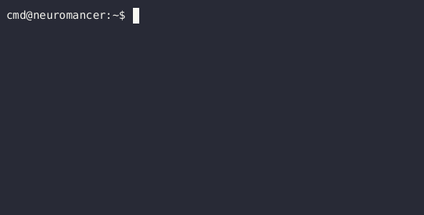

  

`please` is a tiny toy programming language implemented in R. It's pretty much completely useless, but it was a fun exercise to write a lexer, parser and interpreter from scratch. I might add more functionality later. Check out the associated [blog post](https://delfin.sh/posts/toy-language-in-r/) for details. 

  

